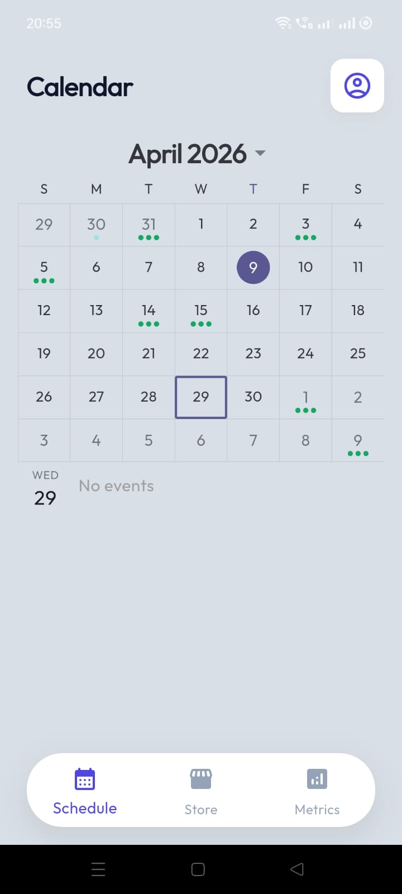
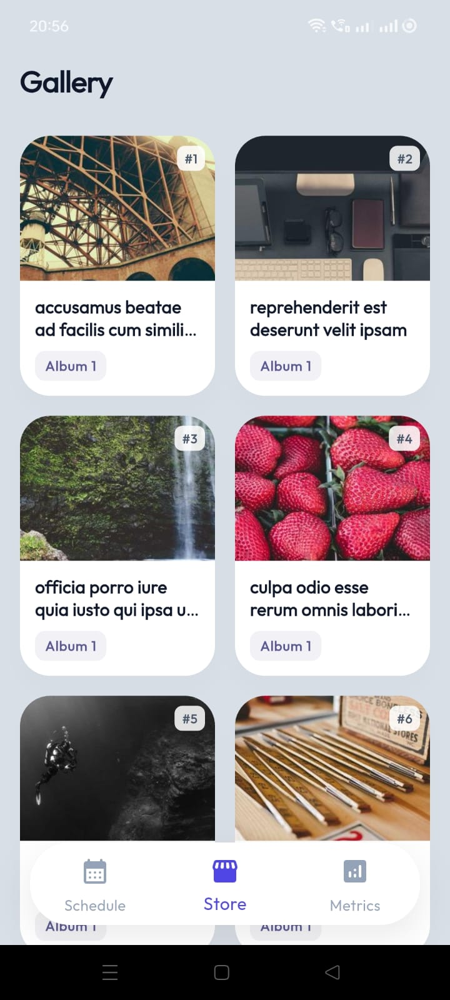
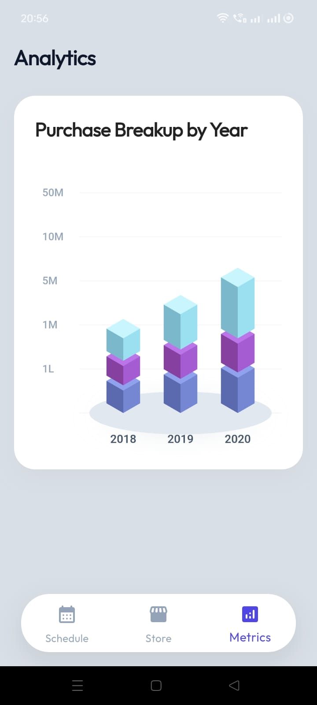
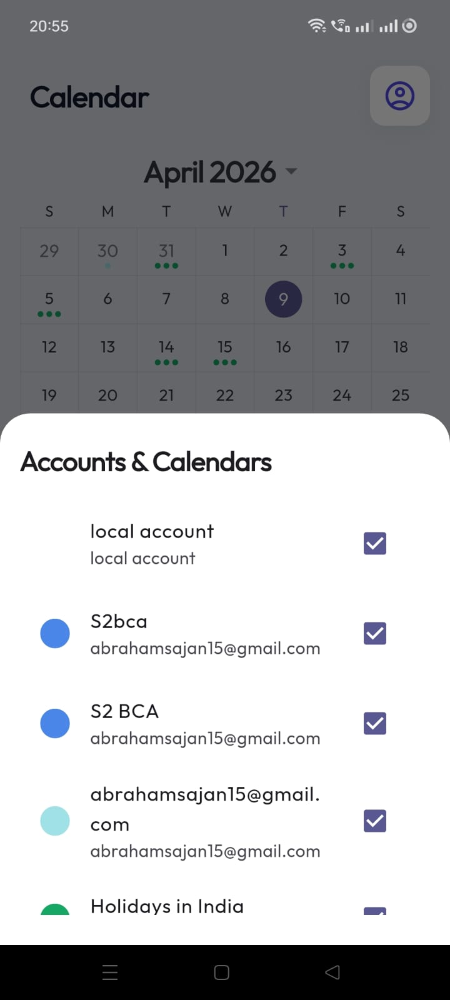

# CalendarPlus Portfolio App

<p align="center">
  
  
  
</p>

This is a Flutter application designed to showcase advanced feature implementations, robust state management, and a clean architectural foundation.

## Screenshots

### Main Screens
*   **Calendar**: High-fidelity month view with event indicators and native integration.
*   **Gallery**: Smooth, responsive photo grid with skeleton loading.
*   **Analytics**: Premium custom-painted isometric bar charts.

<p align="center">
  
  <br>
  <em>Multi-account and calendar filtering system</em>
</p>

## Features Built

### 1. Device Calendar & Account Filtering
- **Account Management**: Supports multi-account selection. Users can toggle specific Google, Outlook, or Local calendars via a premium bottom-sheet selector.
- **Permission Handling**: Requests runtime permissions (`READ_CALENDAR`, `WRITE_CALENDAR`). Parses and maps native events from all synced device accounts.
- **UI**: Visualized beautifully on a monthly layout utilizing `syncfusion_flutter_calendar` with custom event dots (indicators).

### 2. Reliable Image Gallery (API Integration)
- **Data Source**: Performs reliable HTTP fetching against the **JSONPlaceholder** API with custom headers to prevent 403 blocks.
- **Dynamic Images**: Integrates `picsum.photos` for unique, consistent, and beautiful HD images based on photo IDs.
- **Responsive Layout**: A strictly responsive grid (2-columns on mobile, 4+ on tablets) with advanced Shimmer effects for loading states.

### 3. Fintech Analytics / Isometric Chart
- **Custom Painting**: Employs low-level `CustomPainter` to mathematically draw 3D (Isometric) stacked bar charts.
- **Refined UI**: Matches high-fidelity design specs featuring 3-block stacks.

## Architecture Guidelines

The project follows a **Feature-First** structure for maximum scalability:

```
lib/
├── core/
│   ├── theme/           # AppTheme: Fintech Branding (Outfit font)
│   ├── network/         # API Endpoint and Network Config
│   └── utils/           # Responsive layout breakpoints
├── features/
│   ├── dashboard/       # Floating Navigation Shell
│   ├── calendar/        # Provider + SfCalendar with Account Filtering
│   ├── shop/            # Photo Gallery with Picsum CDN & Shimmers
│   └── analytics/       # Static Metrics & Isometric Custom Painters
└── main.dart            # MultiProvider aggregation
```

## Setup & Running

1. **Permissions**: Android manifest includes `network_security_config.xml` to allow images and API traffic.
2. **Native Access**: Ensure you test on a device with entries in the native calendar.
3. **Run**: 
   ```bash
   flutter pub get
   flutter run
   ```
